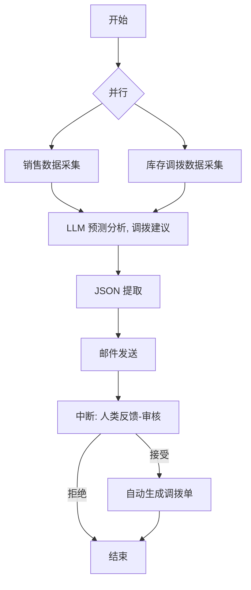

# Double AI Agent

智能调拨助手，基于 Spring AI Alibaba 和 Graph 工作流实现。

## 智能调拨执行流程图

## 项目结构
- `ai-commom`: 公共模块，包含 VO、工具类等。
- `ai-transfer`: 业务模块，处理数据采集、LLM 分析及调拨逻辑。

## Kafka 集成
- `ai-transfer` 在调拨单创建成功并提交事务后，会向 `ai-transfer.transfer-order-created` 发布事件。
- 事件内容包含调拨单 ID、单号、调出/调入仓库、明细数量和明细快照。
- 默认 Kafka 地址配置在 `ai-transfer/src/main/resources/application.yml` 的 `spring.kafka.bootstrap-servers`。
